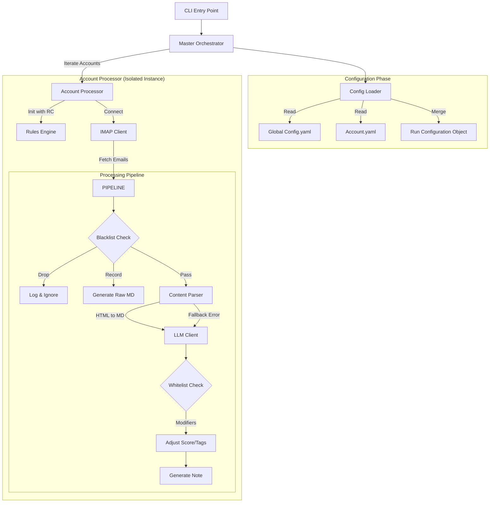

# Project Design Document (PDD): Email Agent V4 "Orchestrator"

**Status:** `Engineering Ready`
**Target Architecture:** Multi-Tenant Event Loop
**Source PRD:** `prd-v4.md`

---

## 1. Overview & Context

*   **Goal:** Upgrade the existing V3 single-account email processor into a multi-account "Orchestrator."
*   **Core Logic:** The system will iterate through defined accounts, dynamically merging global configurations with account-specific overrides, and processing emails through a strictly defined pipeline (Blacklist -> Parse -> LLM -> Whitelist).
*   **Key constraint:** **State Isolation.** Data or configuration from "Account A" must never bleed into "Account B".

## 2. System Architecture

### 2.1 High-Level Diagram (Conceptual)


### 2.2 Component Changes

| Component | V3 State | V4 Target State |
| :--- | :--- | :--- |
| `main.py` | Calls `orchestrator.process_emails()` | Parses args, invokes `MasterOrchestrator`. |
| `settings.py` | Singleton Facade (Global State). | **Refactor:** Must yield specific `Config` objects. Global state limited to env vars/constants. |
| `orchestrator.py` | Single logic flow. | **Split:** `MasterOrchestrator` (loop) and `AccountProcessor` (logic). |
| `config/` | Single `config.yaml`. | `config.yaml` (base) + `config/accounts/*.yaml`. |
| **NEW** `rules.py` | N/A | Handles Blacklist/Whitelist matching logic. |
| **NEW** `content_parser.py` | Implicit in V3. | Handles `html2text` conversion and fallback logic. |

---

## 3. Data Model & Configuration Strategy

### 3.1 Configuration Schema
The configuration system is the "Database" of this application.

**Merge Strategy:**
1.  **Dictionaries:** Deep merged (keys in Override overwrite keys in Base).
2.  **Lists:** **Replace** (List in Override completely replaces List in Base).
3.  **Primitives:** Overwrite.

**File Structure:**
*   `config/config.yaml` (Base)
*   `config/accounts/work.yaml` (Override)
*   `config/accounts/personal.yaml` (Override)
*   `config/blacklist.yaml` (Global Rules)
*   `config/whitelist.yaml` (Global Rules)

### 3.2 Rules Schema (`blacklist.yaml` / `whitelist.yaml`)
```yaml
# blacklist.yaml
- trigger: "sender" # or "subject", "domain"
  value: "no-reply@spam.com"
  action: "drop" # or "record"

# whitelist.yaml
- trigger: "domain"
  value: "important-client.com"
  action: "boost"
  score_boost: 20
  add_tags: ["#vip", "#work"]
```

---

## 4. Implementation Plan

### Phase 1: Configuration & Infrastructure (The Foundation)

#### 1.1 Config Engine Refactor
*   **Module:** `src/config_loader.py` (New/Refactor)
*   **Function:** `load_merged_config(account_name: str) -> dict`
*   **Logic:**
    1.  Load `config.yaml`.
    2.  Check for `config/accounts/{account_name}.yaml`.
    3.  If exists, perform Deep Merge.
    4.  Validate resulting dict against schema.

#### 1.2 Master Orchestrator
*   **Module:** `src/orchestrator.py` (Refactor)
*   **Class:** `MasterOrchestrator`
*   **Responsibilities:**
    *   Handle CLI arguments (`--all`, `--account`).
    *   Perform **Safety Interlock**:
        *   Calculate Total Emails (Sum of `IMAP.search` counts for all targets).
        *   Calculate Cost: `Count * Model_Cost`.
        *   Prompt user: `Estimated cost $0.05. Proceed? (y/n)`.
    *   Loop through accounts and instantiate `AccountProcessor`.

### Phase 2: The Logic Pipeline (The Engine)

#### 2.1 Account Processor
*   **Module:** `src/account_processor.py` (Extracted from old orchestrator)
*   **Class:** `AccountProcessor`
*   **Context:** Initialized with a *specific* `config` dict.
*   **Lifecycle:**
    1.  `setup()`: Connect IMAP using passed config credentials.
    2.  `run()`: Fetch emails -> Pipeline -> Generate -> Tag.
    3.  `teardown()`: Close IMAP connection strongly.

#### 2.2 Rules Engine
*   **Module:** `src/rules.py`
*   **Functions:**
    *   `check_blacklist(email_obj, rules) -> ActionEnum`
        *   Returns: `DROP`, `RECORD`, `PASS`.
    *   `apply_whitelist(email_obj, rules, current_score) -> (new_score, tags_list)`

#### 2.3 Content Parser
*   **Module:** `src/content_parser.py`
*   **Library:** `html2text`
*   **Logic:**
    *   Try: `html2text.handle(email_html_body)`.
    *   Except: Log WARN, Return `email_plain_text_body`, Set flag `processing_error="html_fallback"`.

### Phase 3: CLI & Observability

#### 3.1 CLI Updates
*   **Module:** `src/cli_v4.py` (or update `cli_v3.py`)
*   **Commands:**
    *   `process`: Flags `--account <name>` or `--all`.
    *   `show-config`: Dumps the *merged* YAML for verification.

#### 3.2 Logging
*   **Requirement:** Log "Override" events on startup.
    *   `INFO: Processing Account: Work`
    *   `INFO: Overriding 'imap.username' to 'marc@work.com'`

---

## 5. Technical Specifications (API Contracts)

### 5.1 Internal Object: `EmailContext`
As the email moves through the pipeline, use a Data Class or Dict to track state (avoiding passing 10 arguments).

```python
@dataclass
class EmailContext:
    uid: str
    sender: str
    subject: str
    raw_html: str
    raw_text: str
    
    # State flags
    parsed_body: str = ""
    is_html_fallback: bool = False
    
    # Classification
    llm_score: float = 0.0
    llm_tags: List[str] = field(default_factory=list)
    
    # Rules
    whitelist_boost: int = 0
    whitelist_tags: List[str] = field(default_factory=list)
    result_action: str = "" # PROCESSED, DROPPED, RECORDED
```

### 5.2 External Dependency: `html2text`
*   Add to `requirements.txt`.
*   Configuration: Configure it to ignore links/images if possible to save tokens.

---

## 6. Execution Steps (Developer Guide)

1.  **Setup:** Create `config/accounts/` directory. Create dummy `test.yaml` account override.
2.  **Step 1 - Config:** Implement `src/config_loader.py`. Write a test that merges `config.yaml` with `test.yaml` and asserts that lists are replaced and dicts merged.
3.  **Step 2 - Parser:** Implement `src/content_parser.py`. Test with sample HTML. Ensure fallback works.
4.  **Step 3 - Rules:** Implement `src/rules.py`. Test blacklist "DROP" logic.
5.  **Step 4 - Refactor Orchestrator:**
    *   Rename `src/orchestrator.py` to `src/account_processor.py`.
    *   Create new `src/orchestrator.py` (The Master).
    *   Wire up the Safety Interlock cost calculation.
6.  **Step 5 - Integration:** Update `main.py` point to the new Master Orchestrator.

## 7. Red-Teaming & Guardrails

*   **Risk:** Invalid YAML in an override file crashes the whole batch.
    *   **Mitigation:** `ConfigLoader` must wrap loading in try/catch. If one account fails to load, Log ERROR, skip it, and proceed to the next account (unless valid YAML but invalid Schema).
*   **Risk:** "Wallet Drain" if one account has 10,000 emails.
    *   **Mitigation:** The **Safety Interlock** is mandatory. Ensure `IMAP.search` returns a count *before* `fetch_emails` downloads bodies. Cost calc uses the count.
*   **Risk:** `html2text` produces massive output for newsletter spam.
    *   **Mitigation:** Enforce a strict character limit (e.g., 20,000 chars) on the output of `content_parser`. Truncate if necessary before sending to LLM.

---

**Axon's Note:** This design prioritizes the "Multi-Tenant" requirement. The strict separation of the `MasterOrchestrator` (loop management) and `AccountProcessor` (email logic) is critical. Do not attempt to keep everything in one file.