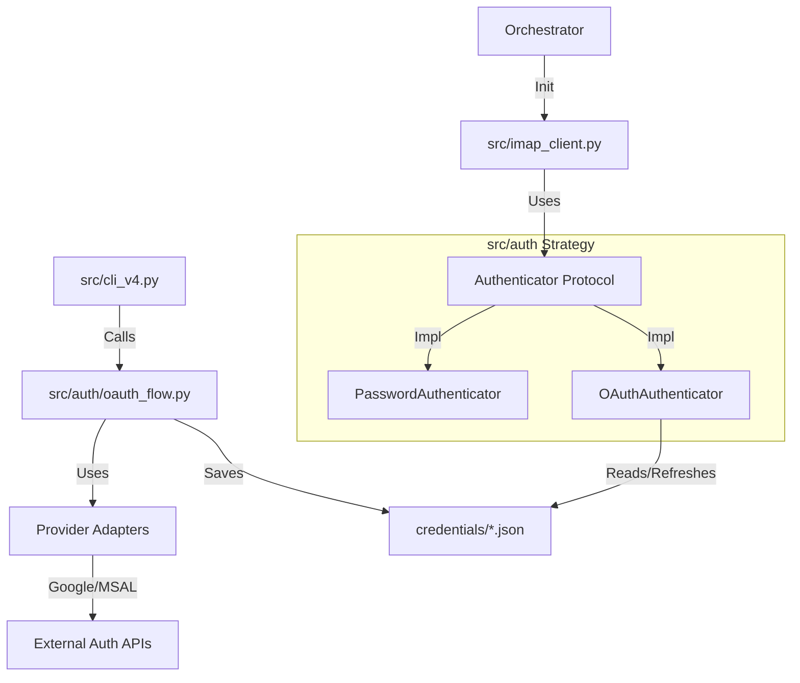

### Critical Analysis & Red-Teaming
Before generating the PDD, I have identified three technical considerations that must be addressed in the implementation plan:

1.  **The "Port Conflict" Risk**: The PRD specifies listening on port 8080 for the OAuth callback. If a developer has another service running there (common), the auth flow will crash. *Solution:* The `OAuthFlow` must attempt port 8080, but fail gracefully or allow configuration if occupied.
2.  **Dependency Isolation**: Google and Microsoft Libraries (`google-auth-oauthlib` vs `msal`) operate differently. `google-auth` abstracts the HTTP server callback; `msal` often requires manual handling or different flows. *Solution:* We will abstract these differences behind a `AuthProvider` adapter pattern within the auth module.
3.  **Config Schema Integrity**: The existing `ConfigLoader` uses Pydantic. We must ensure the new schema uses **Discriminator Unions**. If `method="oauth"`, then `provider` is mandatory and `password_env` is forbidden/ignored. If `method="password"`, `password_env` is mandatory.

Below is the Project Design Document (PDD). It is ready for your task management system and coding agents.

***

# Project Design Document (PDD): V5 OAuth Integration

**Status:** `Approved`
**Version:** 1.0 (Technical Spec)
**Based on:** PRD V5
**Architect:** Axon

---

## 1. Overview & Context

*   **Source:** [PRD V5: OAuth Integration](prd_v5.md)
*   **Technical Problem:** The current `IMAPClient` relies solely on `imaplib.login(user, password)`. Major providers (Google/Microsoft) are deprecating Basic Auth. We must inject a mechanism to generate `XOAUTH2` SASL tokens and handle the complex, interactive browser-based handshake required to acquire them.
*   **Architectural Goal:** Implement OAuth via the **Strategy Pattern** to ensure no regression for existing Basic Auth users.

## 2. System Architecture

### 2.1 High-Level Component Diagram
We are introducing a lateral module `src/auth` that acts as a dependency for `src/imap_client.py` and `src/cli_v4.py`.



### 2.2 The Strategy Pattern (Code Structure)
To decouple authentication from IMAP protocol logic, `IMAPClient` will no longer handle credentials directly.

**Interface:** `src/auth/interfaces.py`
```python
class Authenticator(Protocol):
    def authenticate(self, imap_connection: imaplib.IMAP4_SSL) -> None:
        """Perform the login or authenticate command."""
        ...
```

**Concrete Implementations:**
1.  **`PasswordAuthenticator`**: Reads `password_env`, performs `imap.login()`.
2.  **`OAuthAuthenticator`**: Reads `token_file`, checks expiry, refreshes if needed, generates SASL string, performs `imap.authenticate('XOAUTH2', sasl)`.

## 3. Data Model & Schema

### 3.1 Configuration (`config/accounts/*.yaml`)
We will update `src/config_schema.py` to support a discriminated union for the `auth` field.

**New Schema Definition (Pydantic style):**
```python
# Draft Logic
class AuthMethod(str, Enum):
    PASSWORD = "password"
    OAUTH = "oauth"

class AuthConfig(BaseModel):
    method: AuthMethod = Field(default=AuthMethod.PASSWORD)
    # If method==OAUTH, provider is required
    provider: Optional[Literal["google", "microsoft"]] = None
    # If method==PASSWORD, password_env is required
    password_env: Optional[str] = None
```

### 3.2 Token Storage (`credentials/<account>.json`)
**Type:** JSON File (0600 permissions).
**Google Schema:** (Standard `google-oauth-json` format)
**Microsoft Schema:** (MSAL Cache format or custom JSON wrapper)
```json
{
  "provider": "microsoft",
  "access_token": "...",
  "refresh_token": "...",
  "expires_at": 1709999999,
  "scope": "..."
}
```

## 4. API & Interface Contract

### 4.1 CLI Command
**Command:** `python main.py auth --account <account_name>`
*   **Input:** Account name (must match a file in `config/accounts/`).
*   **Logic:**
    1.  Load account config.
    2.  If `auth.method != 'oauth'`, error out.
    3.  If `credentials/<account>.json` exists, ask to overwrite.
    4.  Initialize `OAuthFlow` with client IDs from `.env`.
    5.  Print auth URL to console -> Launch Browser.
    6.  Listen on `localhost:8080`.
    7.  On success: Save JSON, restrict file permissions.

### 4.2 Env Variables (`.env`)
The following **must** be present for OAuth:
*   `GOOGLE_CLIENT_ID`, `GOOGLE_CLIENT_SECRET`
*   `MS_CLIENT_ID`, `MS_CLIENT_SECRET`

## 5. Implementation Plan

### Phase 1: dependencies & Skeleton
*   **Files:** `src/auth/__init__.py`, `src/auth/interfaces.py`.
*   **Deps:** Add `google-auth-oauthlib`, `msal` to `requirements.txt`.
*   **Security:** Update `.gitignore` to include `credentials/`.

### Phase 2: Configuration & CLI
*   **Schema:** Update `src/config_schema.py` to validate the new `auth` block.
*   **CLI:** Add `auth` command stub to `src/cli_v4.py`.

### Phase 3: The OAuth Engine (`src/auth/`)
*   **Providers:** Create `src/auth/providers/google.py` and `microsoft.py`.
    *   *Note:* Keep provider logic separate. MSAL and Google Auth Lib are very different.
*   **Flow:** Implement `src/auth/oauth_flow.py` to orchestrate the local server and token exchange.
*   **Storage:** Implement `src/auth/token_manager.py` for saving/loading/refreshing JSON.

### Phase 4: Strategy Implementation & Refactor
*   **Authenticators:** Implement `PasswordAuthenticator` and `OAuthAuthenticator` in `src/auth/strategies.py`.
*   **Refactor IMAP:** Modify `src/imap_client.py`.
    *   Change `__init__` to accept an `Authenticator` object.
    *   Remove legacy `login()` logic.
    *   Add `XOAUTH2` SASL string generation utility if not provided by libraries.
*   **Wiring:** Update `src/account_processor.py` to instantiate the correct authenticator based on config and pass it to `IMAPClient`.

## 6. Technical Red-Teaming & NFRs

### 6.1 Reliability
*   **Token Refresh:** The `OAuthAuthenticator` must check `expires_at` (minus a 5-minute buffer) before every connection attempt. If expired, it must validly refresh the token using the `refresh_token` **synchronously** before returning the auth string.
*   **Microsoft "Offline Access":** Ensure the scope `offline_access` is requested, otherwise MS tokens will expire after 1 hour with no refresh capability.

### 6.2 Security
*   **Sanitization:** The `credentials/` folder functions as a keystore. The application must attempt to `chmod 600` on created JSON files to prevent other local users from reading secrets.
*   **Scopes:**
    *   Google: `https://mail.google.com/`
    *   Microsoft: `https://outlook.office.com/IMAP.AccessAsUser.All`

### 6.3 Backward Compatibility
*   **Test Case:** Run the `E2E V4` pipeline with a *Password* based account. It must pass exactly as it does today.
*   **Test Case:** If `auth` block is missing from YAML, `config_loader` must inject the default `method: password` struct to avoid breaking old configs.

## 7. Development Prompts (For AI Coding)

When generating code, you can use these prompts for specific files:

**For `src/auth/strategies.py`:**
> "Implement the Strategy pattern for IMAP authentication. Define a Protocol `Authenticator` with an `authenticate(imap_conn)` method. Create `PasswordAuthenticator` (uses env var password) and `OAuthAuthenticator` (uses TokenManager). The OAuth strategy should handle token refreshing transparently."

**For `src/imap_client.py` refactor:**
> "Refactor IMAPClient to remove direct credential handling. detailed in PDD Section 2.2. Inject the `Authenticator` strategy via `__init__`. In the `connect` method, replace the explicit login call with `self.authenticator.authenticate(self.server)`."

**For `Microsoft` specific logic:**
> "Implement the Microsoft OAuth flow using `msal`. Use `PublicClientApplication`. Ensure the `device_flow` or `localhost` redirection is handled correctly for a CLI environment without a public callback URL."