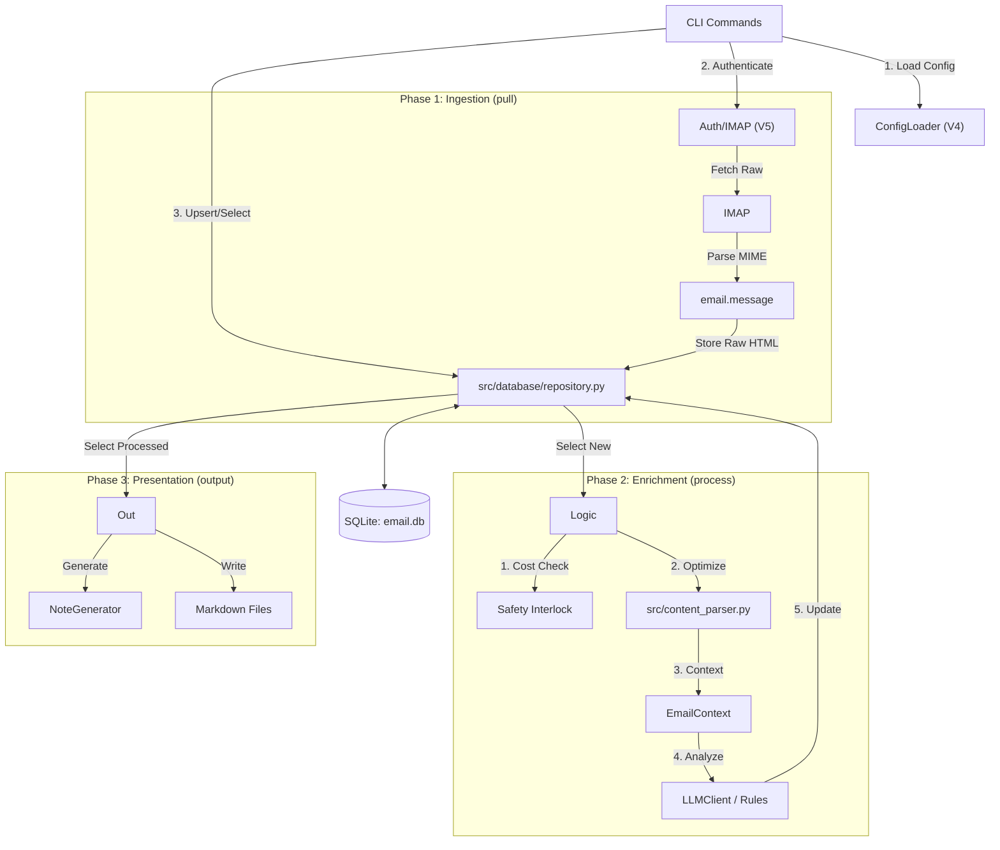

# Project Design Document (PDD): V6 Database Core

*   **Status:** `Approved for Development`
*   **Version:** 1.2 (Revised)
*   **Based on:** [PRD V6: Database Core](prd_v6.md)
*   **Architect:** Axon

---

## 1. Overview & Context

*   **Link to PRD:** [prd_v6.md](prd_v6.md)
*   **Technical Problem Statement:** We are decoupling ingestion (`pull`), processing (`process`), and presentation (`output`). This requires a centralized SQLite database (`email.db`) to serve as the state manager.
*   **Architecture Continuity (CRITICAL):**
    *   **Do Not Reinvent:** We are **not** rewriting the auth system, configuration loader, or IMAP handlers.
    *   **Reuse V4/V5:** We must import and utilize `src/config_loader.py`, `src/imap_client.py` (which handles V5 OAuth), `src/llm_client.py`, and `src/content_parser.py`.
    *   **No "Split-Brain":** If functionality is not explicitly redefined here, the V4 pattern applies by default.

## 2. System Architecture

### 2.1 High-Level Architecture
We are introducing a **Data Access Layer (DAL)**. The existing "Pipeline" logic is broken into three distinct CLI commands, but they rely on the same underlying services.





### 2.2 Directory Structure & Modules
*   `src/database/` (New Package)
    *   `connection.py`: Singleton SQLite connection management.
    *   `schema.py`: SQL Definitions.
    *   `repository.py`: CRUD operations and Object Mapping (The "DAL").
*   `scripts/migrations/`: Manual schema change scripts.

## 3. Data Model & Schema

**Constraint:** The DB stores **Raw HTML**. We do not store the markdown version; we generate it on-the-fly during processing to ensure we can upgrade the parser later without data migration.

**File:** `src/database/schema.py`

```sql
CREATE TABLE IF NOT EXISTS emails (
    id INTEGER PRIMARY KEY AUTOINCREMENT,
    
    -- Identity & Metadata
    account TEXT NOT NULL,       -- Matches ConfigLoader account_id
    imap_uid INTEGER NOT NULL,
    folder TEXT DEFAULT 'INBOX',
    
    -- Content
    subject TEXT,
    sender TEXT,
    received_date TEXT,          -- ISO8601 String
    
    -- Raw Data (Source of Truth)
    headers TEXT,                -- JSON: Full header set
    body_html TEXT,              -- Raw HTML content (Used by ContentParser)
    body_text TEXT,              -- Raw Plaintext content
    attachment_meta TEXT,        -- JSON
    
    -- Processing State
    status TEXT NOT NULL DEFAULT 'new', -- 'new', 'processed', 'processing_failed'
    error_stage TEXT,
    error_message TEXT,
    created_at TIMESTAMP DEFAULT CURRENT_TIMESTAMP,
    processed_at TIMESTAMP,
    
    -- Enrichment Data
    llm_summary TEXT,
    llm_scores TEXT,             -- JSON: {importance: X, spam: Y}
    llm_tags TEXT,               -- JSON: List of tags
    
    -- Output State
    generated_filename TEXT,     -- Path to file on disk

    UNIQUE(account, imap_uid)
);

CREATE INDEX IF NOT EXISTS idx_emails_account_uid ON emails(account, imap_uid);
CREATE INDEX IF NOT EXISTS idx_emails_status ON emails(status);
```

## 4. API & Command Logic

All commands must iterate through accounts using `ConfigLoader.discover_accounts()` just like V4.

### 4.1 Command: `db-init`
*   **Logic:**
    1.  Create `config/email.db` if missing.
    2.  Execute `src/database/schema.py` DDL.

### 4.2 Command: `pull` (Ingestion)
*   **Goal:** Fetch and Store. No Analysis.
*   **Architecture Re-use:** Must use `src/imap_client.py` factories to ensure OAuth works.
*   **Logic (Per Account):**
    1.  **Load Config:** `ConfigLoader.load_merged_config(account)`.
    2.  **Connect:** `imap_client = create_imap_client_from_config(config)`.
    3.  **Fetch UIDs:** Get list of UIDs based on date filters.
    4.  **Local Filter:** `SELECT imap_uid FROM emails WHERE account = ?` to skip existing.
    5.  **Fetch Content:** For *new* UIDs, fetch RFC822 content.
    6.  **Store:** Extract simple fields (Subject, From, Date) and store Raw HTML/Text into DB.
    7.  **State:** **Do NOT update IMAP flags.** V6 is Read-Only on server state.

### 4.3 Command: `process` (Enrichment)
*   **Goal:** Apply Logic to DB records.
*   **Architecture Re-use:** Must use `src/content_parser.py` and `src/account_processor.py` logic (Safety Interlock).
*   **Logic (Per Account):**
    1.  **Select:** `SELECT * FROM emails WHERE status = 'new' AND account = ?`.
    2.  **Safety Interlock:** Calculate estimated cost (Count * Avg Tokens). If > Threshold, **pause for user confirmation** (reusing V4 logic).
    3.  **Hydrate & Optimize:**
        *   Load DB Row.
        *   **CRITICAL:** Call `content_parser.parse_html_content(row['body_html'])`.
        *   Create `EmailContext` object populated with the *parsed markdown* result.
    4.  **Enrichment Pipeline:**
        *   `RulesEngine.apply_blacklist`
        *   `LLMClient.classify` (sends optimized Markdown, not raw HTML)
        *   `RulesEngine.apply_whitelist`
    5.  **Update DB:** Write scores, summary, tags, and set `status='processed'`.

### 4.4 Command: `output` (Presentation)
*   **Goal:** Generate Files.
*   **Architecture Re-use:** Must use `src/note_generator.py`.
*   **Logic (Per Account):**
    1.  **Select:** `SELECT * FROM emails WHERE status = 'processed' AND account = ?`.
    2.  **Generate:** Pass data to `NoteGenerator` (V4/V5 standard).
    3.  **Idempotency Check:** If `row['generated_filename']` exists on disk, delete it.
    4.  **Write:** Save new file. Update DB `generated_filename`.

## 5. Implementation Plan

### Phase 1: Database Foundation
1.  **Setup:** Create `src/database/` structure.
2.  **Repository:** Implement `repository.py`. Ensure it maps DB rows to the existing V4 `EmailContext` class structure so downstream tools work without modification.

### Phase 2: Ingestion (`pull`)
1.  **Integration:** Wire up `pull` command to `ConfigLoader` and `IMAPClient`.
2.  **Verify:** Ensure OAuth credential flow triggers correctly via the existing V5 stack.

### Phase 3: Enrichment (`process`)
1.  **Integration:** Wire up `process` to `ContentParser` (for on-the-fly optimization) and `LLMClient`.
2.  **Safety:** Port the Safety Interlock cost estimator to run against the DB count (`SELECT count(*)`) instead of the IMAP count.

### Phase 4: Output (`output`)
1.  **Integration:** Wire up `NoteGenerator`. Ensure it receives the `EmailContext` object it expects.

## 6. Developer Prompts

**For `src/database/repository.py`:**
> "Create a SQLite repository. Include a method `get_context_from_row(row)` that returns a V4 `EmailContext` object. IMPORTANT: Do not strip HTML tags here; pass the raw HTML to the context so the Process command can handle optimal parsing later."

**For `pull` command:**
> "Implement the 'pull' command. It must iterate through accounts using `ConfigLoader`. Use `src/imap_client` to connect (supporting V5 OAuth). Fetch emails and insert raw data into the `emails` table. Do NOT run rules or LLM yet."

**For `process` command:**
> "Implement the 'process' command. Iterate accounts. Select 'new' emails. 1) Run existing Safety Interlock cost check. 2) For each email, use `src/content_parser.py` to convert the DB's `body_html` into Markdown. 3) Pass that Markdown to `LLMClient`. 4) Update the DB scores."


